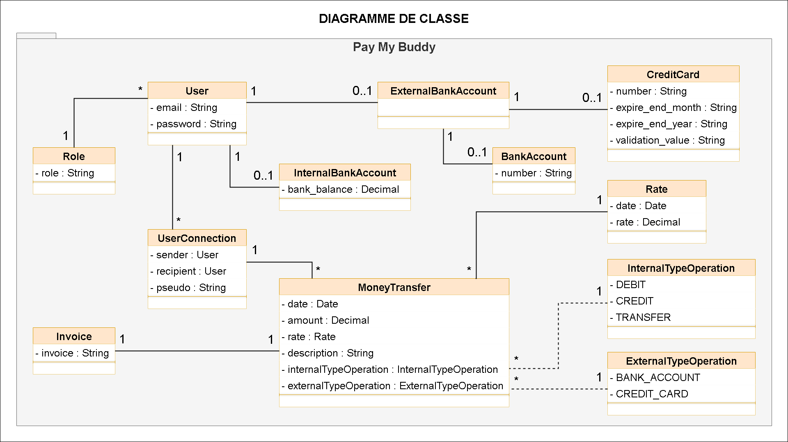
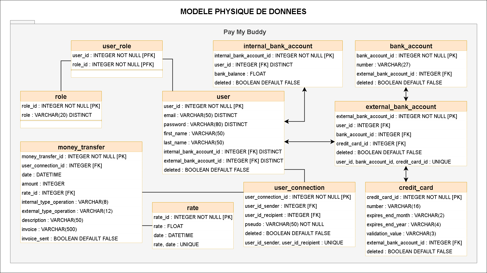

# Pay My Buddy

Il s'agit d'une **application Web de TEST** développée en Java avec Spring Boot 3.

Cette application permet de transférer de l'argent à des contacts utilisant l'application.

**L'alimentation du compte** à partir d'un compte bancaire externe ou d'une carte de crédit **EST SIMULE**.

Après avoir créer un compte, l'identification peut se faire en utilisant:
* un courriel et un mot de passe
* un compte GitHub

## Pour commencer

Faire un fork du projet ou le cloner.

### Pré-requis

* Java				: jdk 17.0.7
* Spring Boot		: 3.1.0
* Maven				: 3.8.7
* Bootstrap			: 5.2.3
* Bootstrap-icons	: 1.10.3
* Jquery			: 3.6.4
* Thymeleaf-extras-springsecurity6
* Oauth2
* MySQL				: 8
* Liste totale		: voir le fichier "pom.xml"

### Lancer les tests unitaires

_Executez la commande_  ``mvn clean test``

### Créer un fichier JAR

_Executez la commande_  ``mvn clean package``

## Démarrer l'application

Copier le dossier "config" et le fichier "PayMyBuddy-0.0.1-SNAPSHOT.jar" dans le même dossier.

_Executez la commande_  ``java -jar PayMyBuddy-0.0.1-SNAPSHOT.jar``

## Tester l'application

**Dans un navigateur internet:**
* Entrer l'adresse: ``http://localhost:8080/``

**Démarrage de l'application:**
* créer un compte:
	* cliquer sur bouton "Create account"
* s'identifier:
	* entrer l'email et le mot de passe + cliquer sur le bouton "Login"
	* [bouton GITHUB](#oauth)

**Menu Home:**
* montant actuel de l'utilisateur

**Menu Transfer:**
* gestion des contacts qui recevront de l'argent: bouton "Add Connection"
	* contact: ajouter, modifier, supprimer
* gestion des transferts d'argent externes: liste déroulante: choisir Me
* gestion des transferts d'argent externes: liste déroulante: choisir le contact

**Menu Profile:**
* gestion du profile:
	* modifier le prénom
	* modifier le nom
	* supprimer le compte
	
* gestion d'un compte externe:
	* numéro de compte bancaire: ajouter, modifier, supprimer
	* numéro de carte bancaire: ajouter, modifier, supprimer

**Menu Contact:**
* envoyer un message au gestionnaire de l'application

**Menu Log off:**
* sortir de l'application

**Information:**
* aucune commission pour un transfert d'argent externe
* une commission de 0.5% est appliquée pour un transfert d'argent interne

 

**Identification avec un compte GITHUB**
* créer un compte github
* configurer l'identification par OAuth2
	* dans GitHub:
		* méthode: ``https://docs.github.com/fr/apps/oauth-apps/building-oauth-apps/creating-an-oauth-app``
		* Homepage URL: mettre ``http://localhost:8080``
		* Authorization callback URL: mettre ``http://localhost:8080/login/oauth2/code/github``
	* dans le fichier "application.properties":
		* à la ligne "spring.security.oauth2.client.registration.github.client-id=xxxxxx" remplacer "xxxxxx" par le numéro de "Client Id" fournit par GitHub
		* à la ligne "spring.security.oauth2.client.registration.github.client-secret=yyyyyy" remplacer "yyyyyy" par le numéro de "Client secrets" fournit par GitHub

## Structure des classes du modèle

## Structure des tables de la base de données.

## Scripts SQL de la base de données.
[Scripts SQL](./src/main/resources/pay_my_buddy.sql)

## Développée avec

* eclipse 4.28.00

## Versions

Dernière version: SNAPSHOT: 0.0.1

## Auteur

* **Philippe PERNET**  _alias_  [@Philiform](https://github.com/Philiform)

## License

Ce projet n'est pas sous licence
